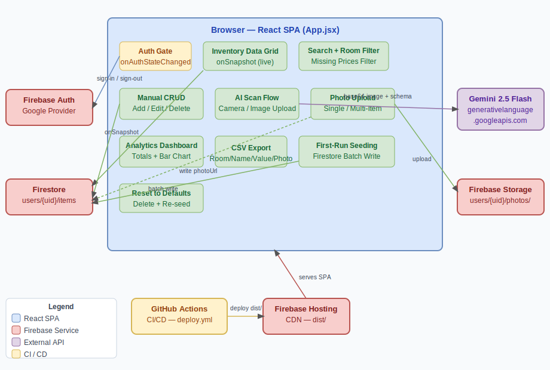

# Home Inventory Tracker — Design

## High-Level Overview

A React single-page application with no traditional backend. Firebase handles auth, data storage, and file storage. The entire UI and application logic lives in `src/App.jsx`. Gemini 2.5 Flash processes scanned document images and returns structured JSON via a REST call made directly from the browser. The app is hosted on Firebase Hosting and deployed automatically via GitHub Actions on every push to `main`.

---

## Architecture Diagram

> Source file for editing: [architecture.drawio](architecture.drawio)

---

## Module Design

### `src/App.jsx`

The entire application. It is divided into logical sections within a single file:

**Auth layer**
- Initialises Firebase App, Auth, Firestore, and Storage on module load.
- `useEffect` subscribes to `onAuthStateChanged`. While loading, a full-screen spinner renders. If no user, the sign-in page renders. If authenticated, the main inventory view renders.
- `handleSignIn` calls `signInWithPopup` with `GoogleAuthProvider`. `handleSignOut` calls `signOut`.

**Firestore layer**
- Two `useEffect` hooks (both triggered when `user` changes) subscribe to `onSnapshot` on `users/{uid}/items` and `users/{uid}/photos`. Both unsubscribe on cleanup.
- On first items load, if the snapshot is empty, `seedDefaultData()` is called — a Firestore batch write of all 72 default items.
- `addItem`, `updateItem`, `deleteItem` call `addDoc`, `updateDoc`, `deleteDoc` directly.

**Storage layer**
- `uploadPhoto(file, itemIds)` uploads to `users/{uid}/photos/{timestamp}.{ext}` via `uploadBytesResumable`, tracks progress, calls `getDownloadURL`, then writes a metadata document to `users/{uid}/photos` (URL + original filename). Optionally links to specified item IDs immediately.
- `handleLinkPhoto(photoUrl, itemIds)` writes the chosen URL to each item's `photoUrl` field — called when the user picks from the gallery picker.
- `handleUnlinkPhoto(itemId)` calls `updateDoc` to set `photoUrl` to `null`; the Storage file and gallery record are left intact.
- `handleDeletePhoto(photoId)` deletes the Firestore metadata document from `users/{uid}/photos`; the Storage file and any existing item `photoUrl` links remain.

**AI scan layer**
- `handleScanImage(file)` reads the file as base64, builds the Gemini API request body (with JSON schema in `generationConfig`), and calls `callGeminiWithBackoff`.
- `callGeminiWithBackoff` wraps the fetch in a retry loop: up to 5 attempts, delays `[1000, 2000, 4000, 8000, 16000]` ms.
- On success, parsed items are placed in `scannedItems` state and the review modal opens.

**State**
- `items` — live array from Firestore items snapshot.
- `photos` — live array from Firestore photos snapshot (gallery metadata).
- `user` — Firebase Auth user object or `null`.
- `authLoading` — boolean, true while `onAuthStateChanged` is resolving.
- `seeding` — boolean, true while the first-run batch write is in progress.
- `searchText`, `roomFilter`, `missingPricesOnly` — filter state.
- `selectedItemIds` — Set of item IDs checked for multi-item photo linking.
- `linkingItemIds` — array of item IDs awaiting a photo selection in the picker modal; `null` when closed.
- `isDragging` — boolean, true while a drag is active over the Photos tab upload zone.
- `scannedItems` — array of items parsed from Gemini, held pending review.
- `uploadProgress` — number 0–100 for the active upload, or `null` when idle.
- `viewerUrl` / `viewerItemId` — URL and item ID for the full-size photo viewer modal.
- Modal states: `showAddModal`, `showResetModal`, `deletingItem`, `scannedItems`, `linkingItemIds`, `viewerUrl`.

**Derived values (useMemo)**
- `filteredItems` — `items` filtered by `searchText`, `roomFilter`, `missingPriceOnly`.
- `roomStats` — per-room total value and percentage of grand total.
- `dashboardStats` — total value, total count, valued count, pending count.

**CSV export**
- `exportCSV` builds a string with columns Room, Item Name, Estimated Value, Photo URL, creates a Blob, and triggers a download via a transient `<a>` element.

---

## Design Decisions

### Single file (`App.jsx`)
The user spec explicitly required a single-file app. Keeping all logic in one file avoids any import graph complexity and makes the app trivially portable.

### Firestore over localStorage
localStorage is device-local and lost on browser clear. Firestore gives per-user cloud persistence and real-time sync across tabs and devices with minimal code (`onSnapshot`).

### Firebase Storage for photos
Firestore documents have a 1 MB size limit — base64 images can't be stored inline. Firebase Storage is the natural pairing: photos live in Storage, only the download URL lives in the Firestore item document.

### Central photo gallery with item linking
Photos are uploaded to a dedicated Photos tab and stored in two places: the file in Firebase Storage and a lightweight metadata document in `users/{uid}/photos`. Items don't own photos — they hold a reference URL. This means the same photo can link to any number of items, and deleting a gallery record doesn't cascade to items. The separation keeps item CRUD simple and gives the gallery its own managed lifecycle.

### Gemini JSON schema enforcement
Setting `response_mime_type: "application/json"` and `response_schema` in `generationConfig` removes the need for fragile regex parsing. The model is constrained to return a valid array of `{ room, item, value }` objects.

### Exponential backoff
Mobile networks and the Gemini API are both susceptible to transient errors. Five retries with doubling delays handle temporary outages without bombarding the API.

### No backend / no Cloud Functions
Auth, storage, and database are all handled by Firebase client SDKs. There's nothing server-side to maintain, scale, or secure beyond Firestore rules.

---

## Technology Stack

| Layer | Technology | Rationale |
|-------|-----------|-----------|
| UI framework | React 18 + Vite | Fast dev, JSX, modern build |
| Styling | Tailwind CSS | Utility-first, no extra CSS files |
| Icons | Lucide Icons | Consistent, tree-shakeable icon set |
| Auth | Firebase Auth (Google provider) | One-click Google Sign-In |
| Database | Firebase Firestore | Real-time sync, per-user security rules |
| File storage | Firebase Storage | Photo uploads, UID-scoped access rules |
| AI | Gemini 2.5 Flash REST API | Multimodal image input, structured JSON output |
| Hosting | Firebase Hosting | CDN-backed, integrates with GitHub Actions |
| CI/CD | GitHub Actions | Automated build + deploy on push to `main` |

---

## Deployment

Every push to `main` triggers `.github/workflows/deploy.yml`:
1. Checkout code
2. Install dependencies (`npm ci`)
3. Build (`npm run build`) — Vite outputs to `dist/`
4. Deploy `dist/` to Firebase Hosting via `FirebaseExtended/action-hosting-deploy@v0`
5. Deploy `firestore.rules` and `storage.rules` via `firebase-tools`

All Firebase config values are stored as GitHub Actions Secrets and injected as `VITE_*` env vars at build time.

---

## Constraints & Known Limitations

| Constraint | Detail |
|-----------|--------|
| Single file | All UI and logic in `App.jsx` — no component split-outs per spec |
| 10 MB photo limit | Enforced client-side; Firebase Storage has no hard cap but large files hurt UX |
| Gemini API key | Must be set in `.env`; the app degrades gracefully (prompts user) if missing |
| Photo deletion from Storage | Removing a photo from an item only clears the URL in Firestore — the file remains in Storage (avoids accidental deletion when same photo is linked to multiple items) |
| Offline support | No offline mode; Firestore `onSnapshot` requires connectivity for the initial load |
| Browser compatibility | Requires a modern browser with ES2020 support; no IE11 |
